

|[:skull:ISSUE](https://github.com/frankyhub/CamCar_Speedy_AP/issues?q=is%3Aissue)|[:speech_balloon: Forum /Discussion](https://github.com/frankyhub/CamCar_Speedy_AP/discussions)|[:grey_question:WiKi](https://github.com/frankyhub/CamCar_Speedy_AP/wiki)||
|--|--|--|--|
| | | | |
||<a href="https://github.com/frankyhub/CamCar_Speedy_AP/issues">|<a href="https://github.com/frankyhub/CamCar_Speedy_AP/discussions">|<a href="https://github.com/frankyhub/CamCar_Speedy_AP/releases">|
|| <a href="https://github.com/frankyhub/CamCar_Speedy_AP/pulse" alt="Activity">| <a href="https://github.com/frankyhub/CamCar_Speedy_AP/graphs/traffic">  |<a href="https://github.com/frankyhub?tab=stars"> |

## Story

Diese Anleitung beschreibt ein Remote Controlled Car Robot mit Handy-Steuerung und Web-Cam. Der Antrieb erfolgt über zwei Getriebe-Motore, als Spannungversorgung dienen zwei Akkus oder optional eine Powerbank bzw. eine 9V-Batterie. Das Herzstrück ist ein ESP32-CAM, die Bodenplatte wird aus einer 4mm Sperrholzplatte gelasert. Nach anlegen der Versorgungsspannung startet das Programm mit einem Access Point (AP). Der AP wird in den WLAN-Einstellungen des Handy/Tablet aufgerufen und danach mit der IP-Adresse 192.168.4.1 der WEB-Server im Browser gestartet. Mit dem WEB-Server steht das Kammerabild und die Motor-Steuer-Buttons zur Verfügung.

## Hardware

Die Stückliste für das CamCar:

| Anzahl | Bezeichnung | 
| -------- | -------- | 
|  1 |  ESP32-CAM  |
|  1 |  ESP32-CAM Shield  |
| 1  |  Sperrholzplatte DINA4 4mm |
|  8 |  Platinenhalter (3D-Druck)  |
| 2  |  Getriebemotore mit Räder  |
| 1  |  Lenkrolle mit Abstandsplatte  |
| 1  | Schalter   |
| 1  |  Dual-H-Brücke-DC-Motorantrieb L298N  |
| 2  |  18650 Akkus mit Akkucase (optional eine Powerbank oder 9V Batterie)  |
|   |  Kleinmaterial, Schrauben, Muttern, Klemmen, Platinenstecker, Schaltdraht  |
| ---  | ---    |

## Aufbau und Montage

Der Aufbau und die Montage des CamCars ist in mehrere Schritte unterteilt.

Schritt 1: Die Sperrholzplatte lasern

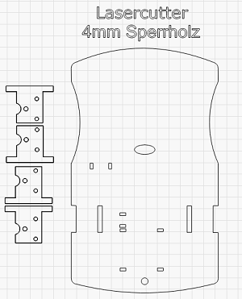

Schritt 2: Acht Platinenhalter drucken.

Die Platinenhalter tragen den ESP32 und die H-Brücke. Sie werden auf die Bodenplatte geklebt.

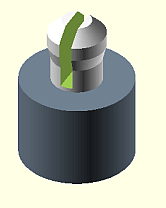

Schritt 3: Die vier Getriebemotore auf die Bodenplatte montieren (Senkkopfschrauben M3x30).

Die Lötfahnen zeigen jeweils nach innen.

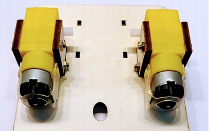

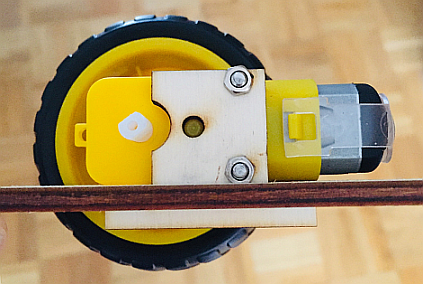

Schritt 4: Die Bauelemente nach Schaltplan verdrahten.

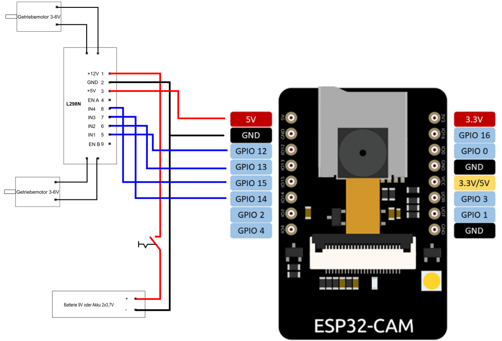

ESP32-CAM - L298N Verdahtung:

| L298N  | ESP32 | 
| -------- | -------- | 
| IN1	  |   12 |
| IN2	  | 13   |
| IN3	  |  14  |
|  IN4	 |  15  |
| 5V	  |   5V	 |
| GND  |  GND  |
| ---  |  ---  |

Den ESP32 auf das ESP-Shield stecken und nach Schaltplan verdrahten.

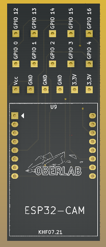

L298N Verdahtung:

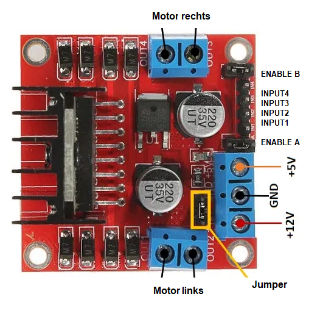

Schritt 5: Das Akku-Case und den Motor-Treiber L298N auf die Bodenplatte montieren. Den ESP32-CAM mit dem Shield auf die Oberseite montieren.

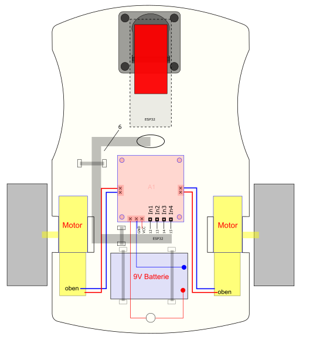

ESP32-CAM:

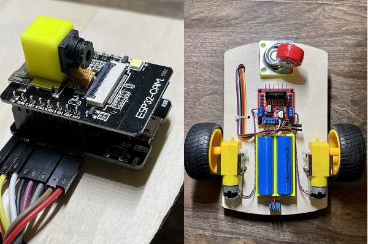

Schritt 6: Das vordere Lenkrad montieren und die beiden Räder auf die Getriebemotore stecken.

Schritt 7: Das Programm in den ESP32-CAM laden.

Schritt 8: In den WLAN Einstellungen des Handys/Tablet den ESP wählen und im Browser den WEB-Server mit der IP 192.168.4.1 aufrufen.

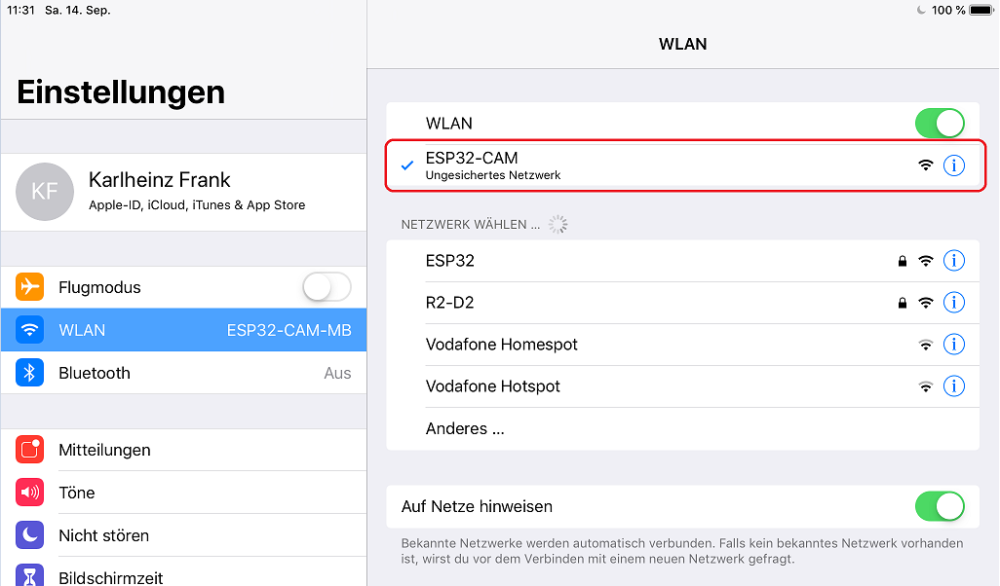

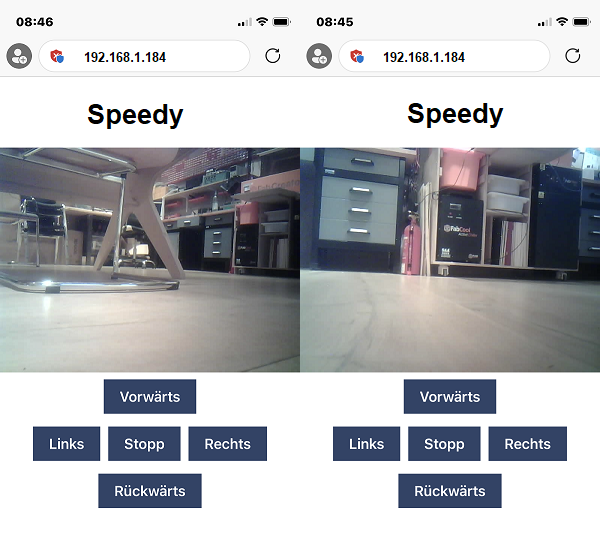

---

   
<ol class="breadcrumb" style="border-top: 2px solid black;border-bottom:2px solid black; height: 45px; width: 900px;"> 
<a href="#oben">nach oben</a>
</ol>

  

---

